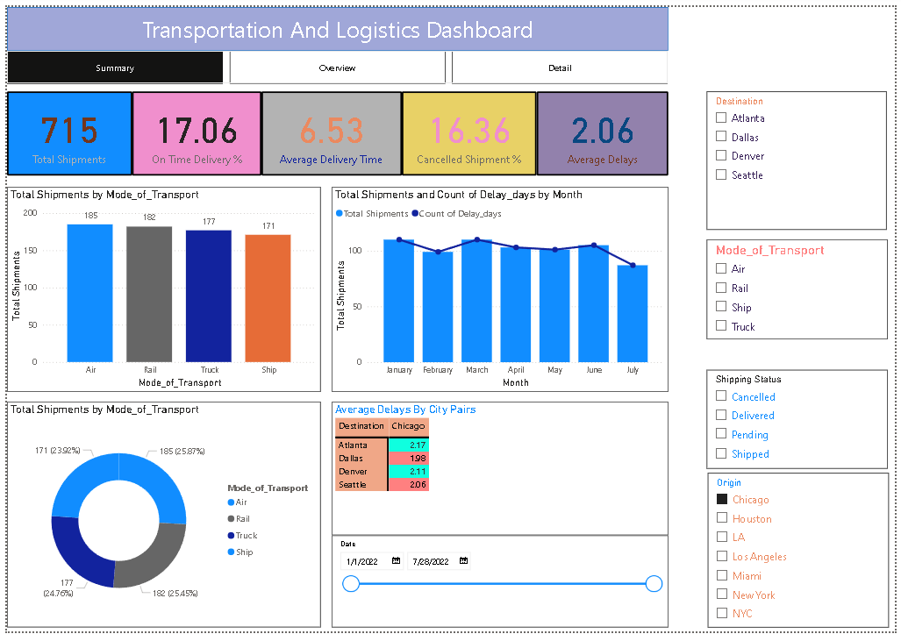

# Logistics & Supply Chain Dashboard (Power BI)

## 📊 Project Overview

This project analyzes logistics and transportation performance using an interactive Power BI dashboard. It helps track shipments, delivery efficiency, and delays.

## 🚀 Key Features

* KPI tracking (Total Shipments, On-Time Delivery %, Avg Delivery Time, Cancelled Shipments, Avg Delays)
* Monthly shipment trends
* Transport mode comparison (Air, Rail, Truck, Ship)
* Interactive filters (Origin, Destination, Shipping Status)

## 🛠 Tools Used

* Power BI
* Data Visualization

## 📷 Dashboard Preview

## 📌 Key Insights

* Air transport has the highest number of shipments
* Delivery performance varies across transport modes
* Certain locations show higher delays

## 🔄 Project Status

Currently improving with additional insights and better design.

## 📌 Note

Dataset is embedded within the Power BI (.pbix) file.
